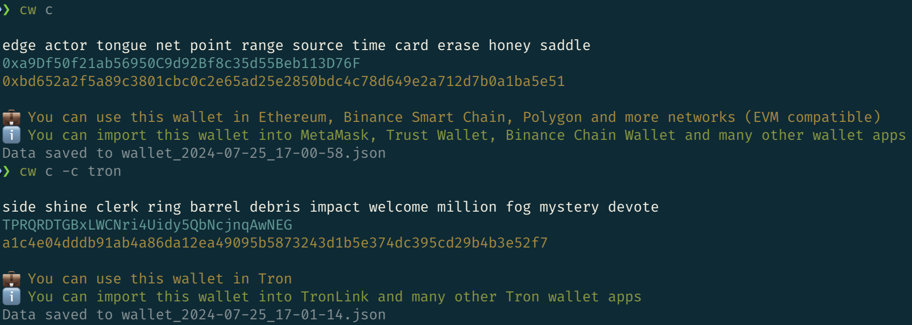

# Crypto Wallet CLI

Crypto Wallet CLI is a command-line tool for generating and managing Binance Smart Chain (BSC) wallets. It allows you to create new wallets from a mnemonic phrase, retrieve the balance of a given address, and more.




## Features

- Generate a BSC, Ethereum, or Tron wallet from a mnemonic or create a new one
- Retrieve the balance of a given BSC, Ethereum, or Tron address
- Save wallet details (mnemonic, address, private key) to a JSON file with a timestamped filename

## Installation

1. Clone the repository:

   ```bash
   git clone https://github.com/penn201500/crypto_wallet_generator
   cd crypto-wallet-cli
   ```
2. Create a conda environment and install dependencies:

   ```bash
   conda create -n cryptowallet-cli python=3.12
   conda activate cryptowallet-cli
   pip install -e .
   ```
   
3. Create a .env file in the project root directory with the following content
```bash
INFURA_URL=your_infura_url
TRON_API_KEY=your_tron_api_key
```

## Usage

### Generate a Wallet

To create a new BSC/Ethereum wallet, run:

```bash
cw c
```

To create a new Tron wallet, run:
```bash
cw c -c tron
```

To create a BSC/Ethereum wallet from an existing mnemonic, run:

```bash
cw c -m "your twelve word mnemonic here"
```

To create a Tron wallet from an existing mnemonic, run:

```bash
cw c -m "your twelve word mnemonic here" -c tron
```

To specify a custom filename prefix for saving the wallet details, run:

```bash
cw c -m "your twelve word mnemonic here" -p mywallet
```

### Get Balance

To get the balance of a BSC address, run:

```bash
cw b -a 0xYourBSCAddress
```

To get the balance of a Tron address, run:

```bash
cw b -a 0xYourBSCAddress -c tron
```

### Generate Mnemonic

To generate a new mnemonic phrase, run:

```bash
cw m
```

### Generate multiple wallets

To generate 3 BSC/Ethereum wallets, run:

```bash
cw -c -n 3
```
To generate 3 Tron wallets, run:

```bash
cw -c -n 3 -c tron
```

## Options

- **c, --create-wallet**: Create a new wallet from a mnemonic and save to a file.
   - `-m, --mnemonic [value]`: The mnemonic to create a new wallet.
   - `-p, --prefix [value]`: The prefix for the JSON filename.
   - `-n, --number [value]`: The number of wallets to create.
   - `-c, --chain [value]`: The blockchain (ethereum, bsc, tron).

- **b, --balance**: Get the balance of an address.
   - `-a, --address [value]`: The address to get the balance of.
   - `-c, --chain [value]`: The blockchain (ethereum, bsc, tron).

- **m, --generate-mnemonic**: Generate a new mnemonic phrase.

## Running Tests

To run the tests for the utility functions, use the following command:

```bash
python -m unittest discover -s tests -v
```

## Acknowledgments

This project is inspired by [yerofey/cryptowallet-cli](https://github.com/yerofey/cryptowallet-cli). If you need a JavaScript version, please check out their project.

## License

This project is licensed under the MIT License. See the [LICENSE](LICENSE) file for details.
